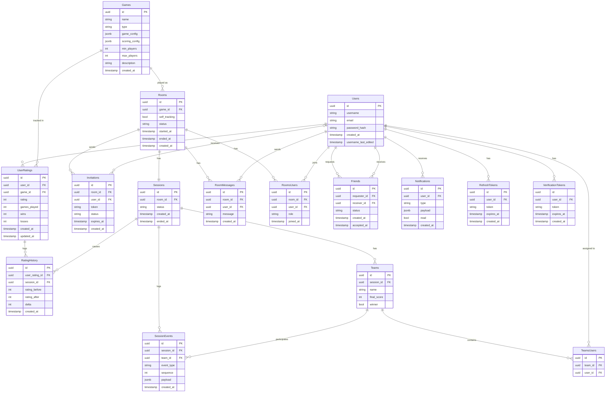

```mermaid
erDiagram
  Users {
    uuid id PK
    string username
    string email
    string password_hash
    timestamp created_at
    timestamp username_last_edited
  }

  UserRatings {
    uuid id PK
    uuid user_id FK
    uuid game_id FK
    int rating
    int games_played
    int wins
    int losses
    timestamp created_at
    timestamp updated_at
  }

  RatingHistory {
    uuid id PK
    uuid user_rating_id FK
    uuid session_id FK
    int rating_before
    int rating_after
    int delta
    timestamp created_at
  }

  Games {
    uuid id PK
    string name
    string type
    jsonb game_config
    jsonb scoring_config
    int min_players
    int max_players
    string description
    timestamp created_at
  }

  Invitations {
    uuid id PK
    uuid room_id FK
    uuid user_id FK
    string token
    string status
    timestamp expires_at
    timestamp created_at
  }

  Teams {
    uuid id PK
    uuid session_id FK
    string name
    int final_score
    bool winner
  }

  TeamsUsers {
    uuid id PK
    uuid team_id FK
    uuid user_id FK
  }

  Sessions {
    uuid id PK
    uuid room_id FK
    string status
    timestamp created_at
    timestamp ended_at
  }

  SessionEvents {
    uuid id PK
    uuid session_id FK
    uuid team_id FK
    string event_type
    int sequence
    jsonb payload
    timestamp created_at
  }

  Rooms {
    uuid id PK
    uuid game_id FK
    bool self_tracking
    string status
    timestamp started_at
    timestamp ended_at
    timestamp created_at
  }

  RoomMessages {
    uuid id PK
    uuid room_id FK
    uuid user_id FK
    string message
    timestamp created_at
  }

  RoomsUsers {
    uuid id PK
    uuid room_id FK
    uuid user_id FK
    string role
    timestamp joined_at
  }

  Friends {
    uuid id PK
    uuid requester_id FK
    uuid receiver_id FK
    string status
    timestamp created_at
    timestamp accepted_at
  }

  Notifications {
    uuid id PK
    uuid user_id FK
    string type
    jsonb payload
    bool read
    timestamp created_at
  }

  RefreshTokens {
    uuid id PK
    uuid user_id FK
    string token
    timestamp expires_at
    timestamp created_at
  }

  VerificationTokens {
    uuid id
    uuid user_id FK
    string token
    timestamp expires_at
    timestamp created_at
  }

  Games ||--o{ Rooms : "played as"
  Rooms ||--o{ RoomsUsers : "has"
  Users ||--o{ RoomsUsers : "joins"
  Rooms ||--|| Sessions : "has"
  Sessions ||--o{ Teams : "has"
  Teams ||--o{ TeamsUsers : "contains"
  Users ||--o{ TeamsUsers : "assigned to"
  Sessions ||--o{ SessionEvents : "logs"
  Teams ||--o{ SessionEvents : "participates"
  Rooms ||--o{ Invitations : "sends"
  Users |o--o{ Invitations : "receives"
  Users ||--o{ UserRatings : "has"
  Games ||--o{ UserRatings : "tracked in"
  UserRatings ||--o{ RatingHistory : "logs"
  Sessions ||--o{ RatingHistory : "causes"
  Users ||--o{ Friends : "requests"
  Users ||--o{ Friends : "receives"
  Users ||--o{ Notifications : "receives"
  Rooms ||--o{ RoomMessages : "has"
  Users ||--o{ RoomMessages : "sends"
  Users ||--o{ RefreshTokens : "has"
  Users ||--o{ VerificationTokens : "has"
```